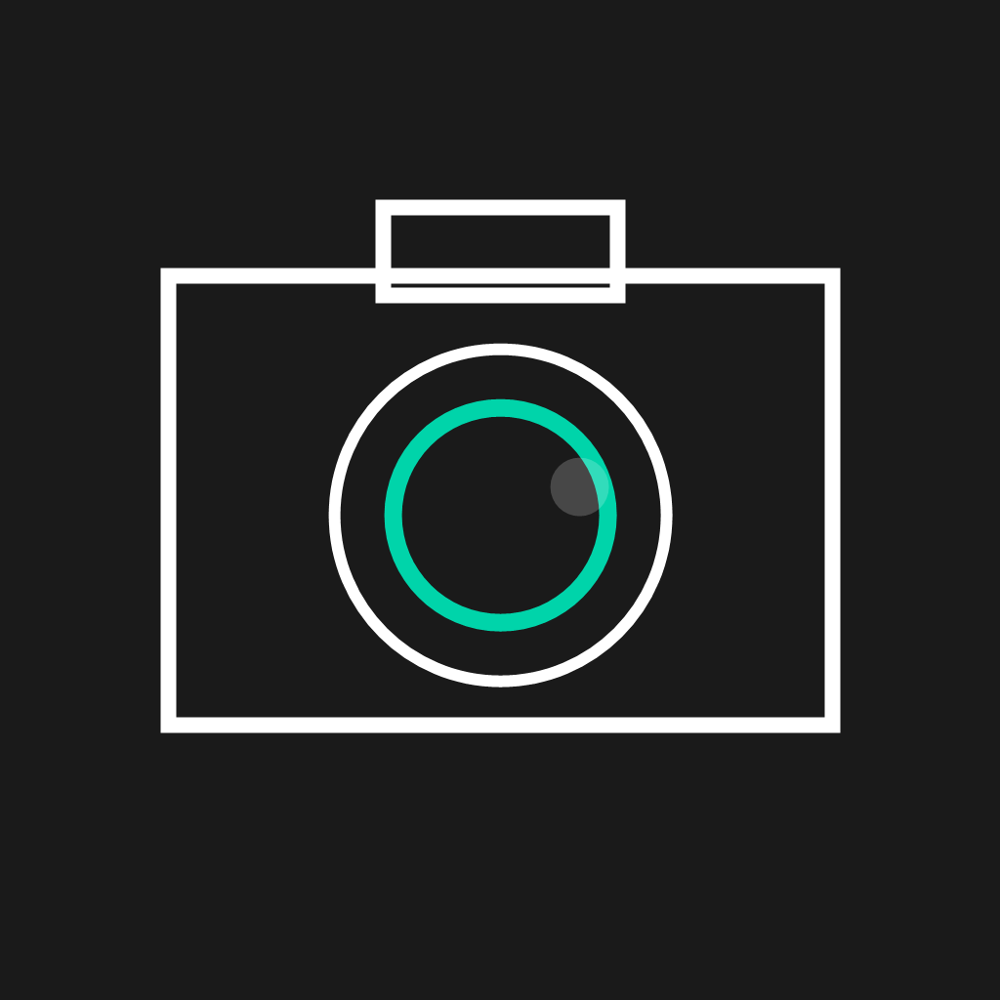
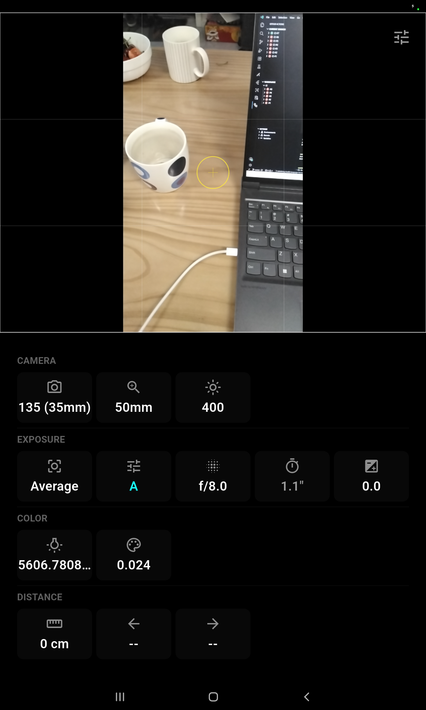
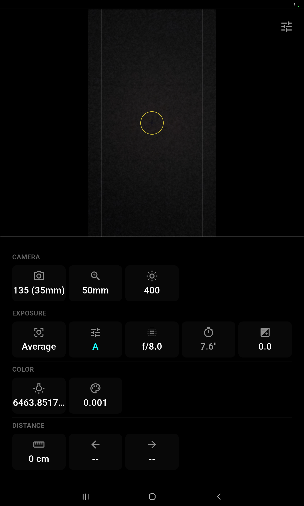

<picture>
  <source media="(prefers-color-scheme: dark)" srcset="https://img.shields.io/badge/license-GPLv3-blue?style=flat-square&labelColor=1a1a1a">
  
</picture>

<p align="center">
  
</p>

# FilmCam Papi

A professional camera assistant for mobile — real-time light metering, color temperature measurement, distance/range finding, and full manual exposure control.

> **Status**: Active development. Android (tested on Galaxy Tab S5e / SM-T500). iOS in development (CI builds passing).

## Screenshots

<p float="left">
  
  
</p>

## Features

| Category | Capability |
|----------|-----------|
| **Metering** | Spot / Center-weighted / Average multi-zone metering with live EV scale |
| **Exposure** | Aperture (f/1.0–f/22), Shutter (1/8000″–30″), ISO (25–6400), EV compensation (±3 in ⅓ steps) |
| **Priority** | Aperture-priority (A), Shutter-priority (S), Full manual (M) with auto-exposure sync |
| **Color** | Real-time CCT (color temperature) + DUV measurement from live camera feed |
| **Distance** | Hyperfocal distance calculation, focus range engine |
| **Settings** | Press-drag in-place picker for every parameter; film format selection (35mm – 4×5″) |

## Architecture

```
lib/
├── engines/          # Core algorithms: metering, color temp, range, viewfinder
├── models/           # Data models: Exposure, ColorTempReading, Distance, CalibrationProfile
├── providers/        # CameraProvider — central state + camera lifecycle
├── screens/          # Home screen with preview + settings layout
├── services/         # CameraService, CalibrationService, DepthService
├── widgets/          # UI components: SettingsPanel, CameraViewfinder, HUD, MeterBar, etc.
└── main.dart         # App entry point
```

## Roadmap

- **Distance measurement**
  - Multi-camera devices: rangefinder-style focus assist using dual/triple camera disparity
  - Single-camera devices: monocular vision-based distance estimation via ML
- **iOS CI & release** ✅ CI builds, unsigned `.app` released on tag
- **iOS native** ✅ Camera metadata + ARKit Scene Depth implemented (iOS 14+)
- **Signed iOS builds** — Obtain Apple Developer certificate for production release

## Building

### Android

```bash
flutter pub get
flutter build apk --debug
adb install -r build/app/outputs/flutter-apk/app-debug.apk
```

### iOS (on macOS, requires Apple Developer certificate for signed builds)

```bash
flutter pub get
flutter build ios --no-codesign --debug  # unsigned, CI use
flutter build ios --debug                # signed, device use
```

## Acknowledgements

- [camera](https://pub.dev/packages/camera) – CameraX + AVFoundation integration
- [ARKit](https://developer.apple.com/augmented-reality/arkit/) – Scene Depth for distance measurement (iOS)
- [tflite_flutter](https://pub.dev/packages/tflite_flutter) – On-device ML inference
- [sensors_plus](https://pub.dev/packages/sensors_plus) – Device orientation
- [Provider](https://pub.dev/packages/provider) – State management

## License

GNU General Public License v3.0 — see [LICENSE](LICENSE).
